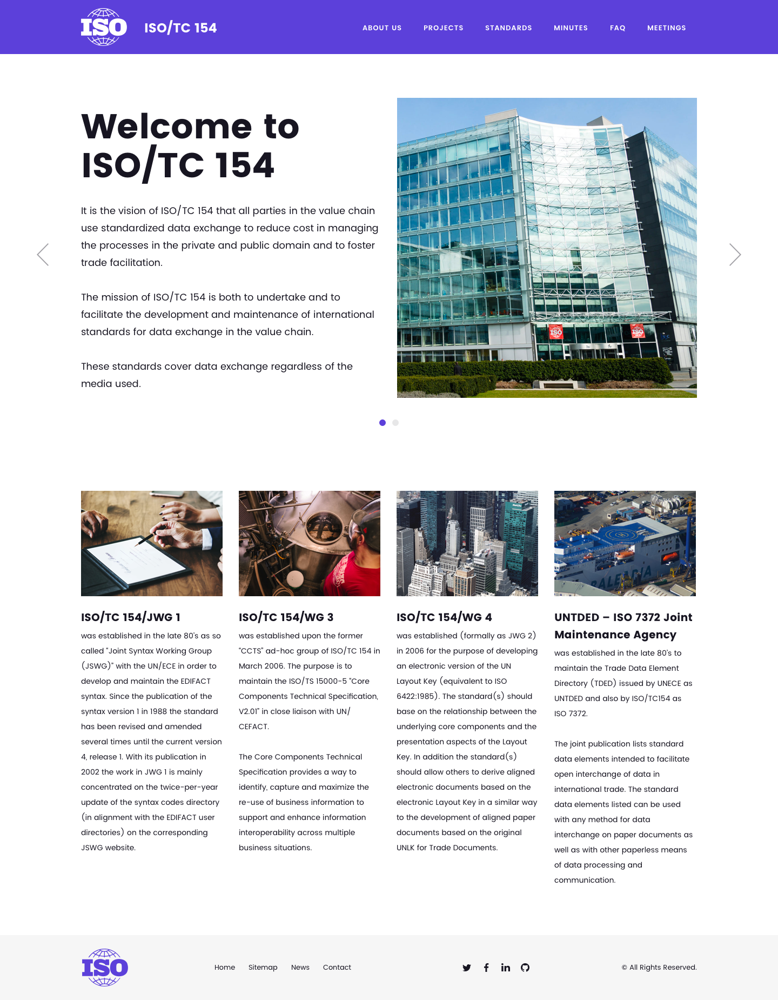
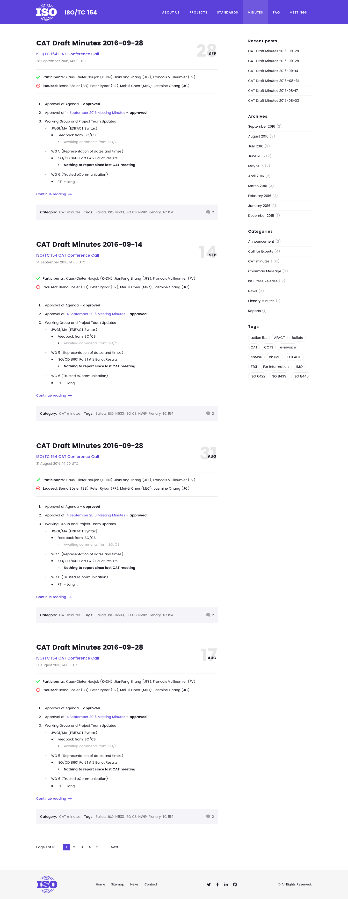
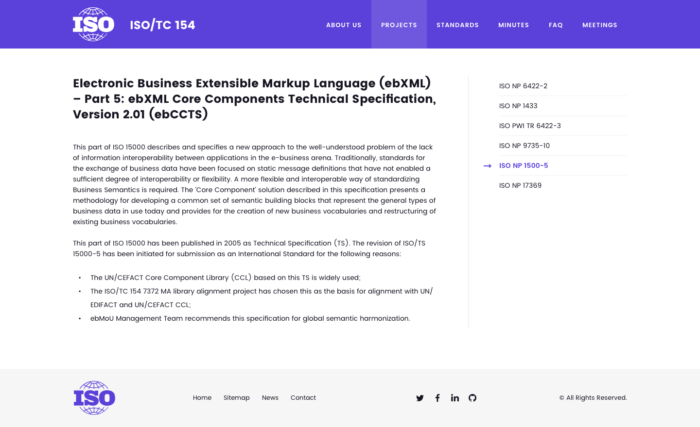
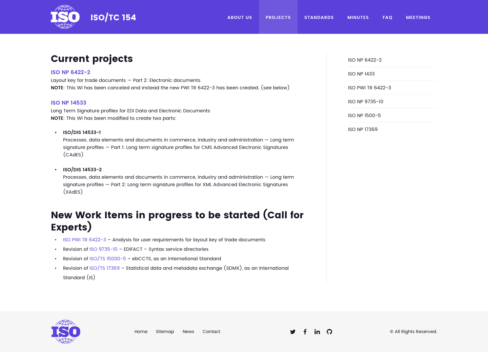
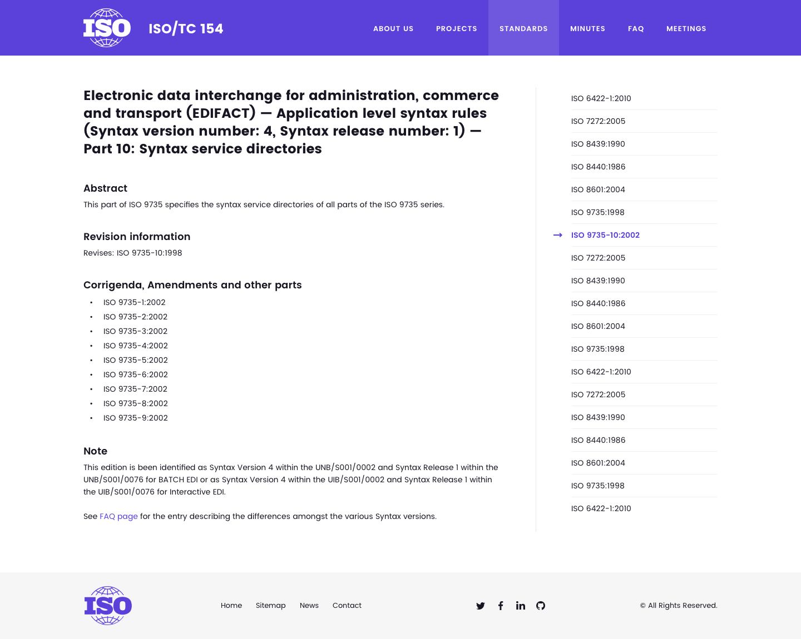
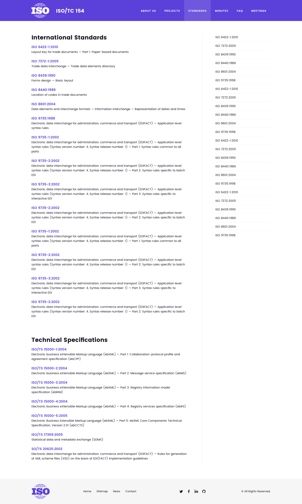

= ISO/TC 154 Website Design

== General

This is where we place the ongoing design of ISO/TC 154's website.

== TODOs

. Add bio links of Chair, WG conveners and project leaders in About

. Add "`standard application and implementation`" for each project on their Project page. For example, the standard was quoted by other standards; implemented/applied by which country/area/products, etc.

. Add "`related liaisons`" for each project on their Project page, including the liaison name and its contributions on the project.

== Homepage

== Minutes

== Project details

== Projects

== Standard details

== Standards

